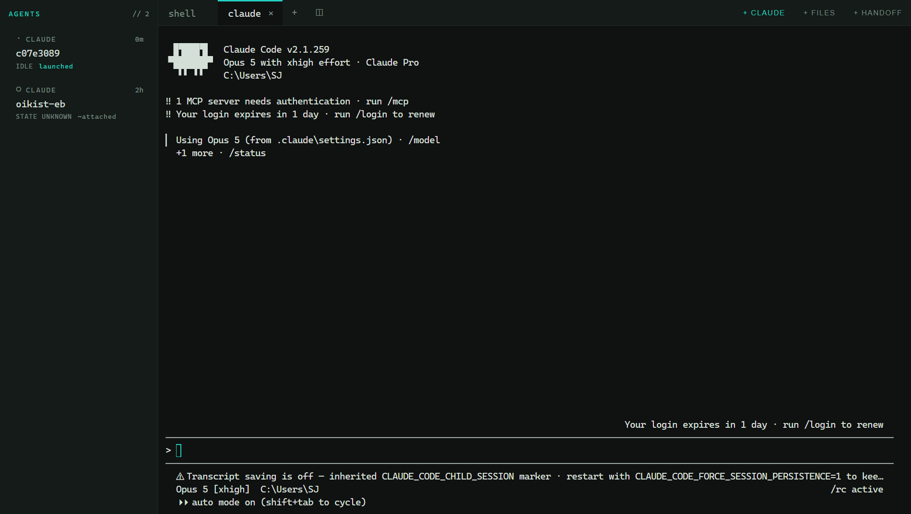
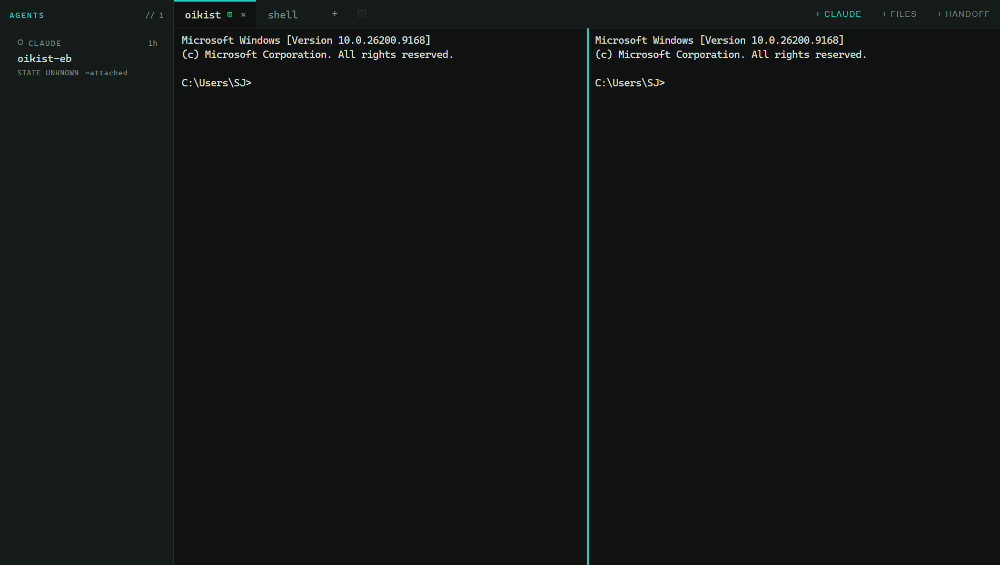
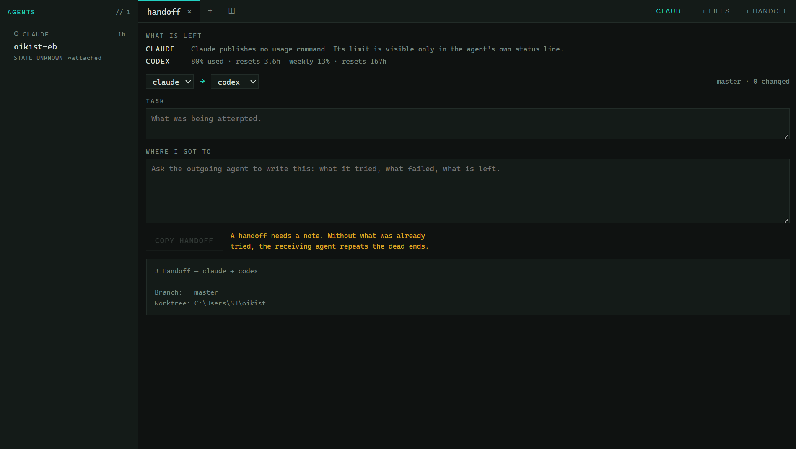
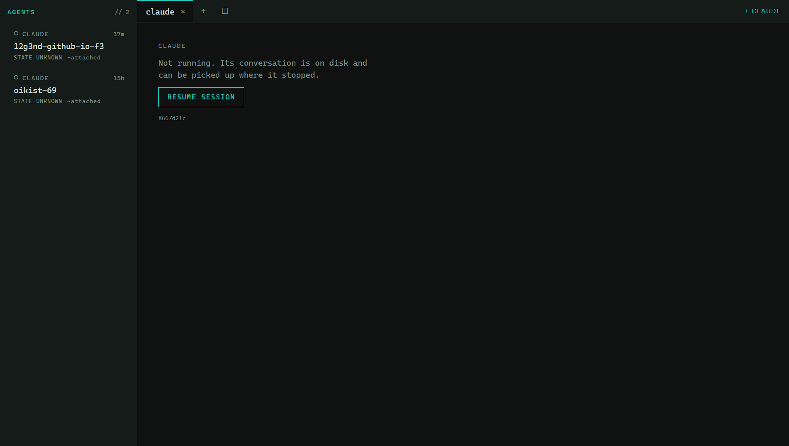
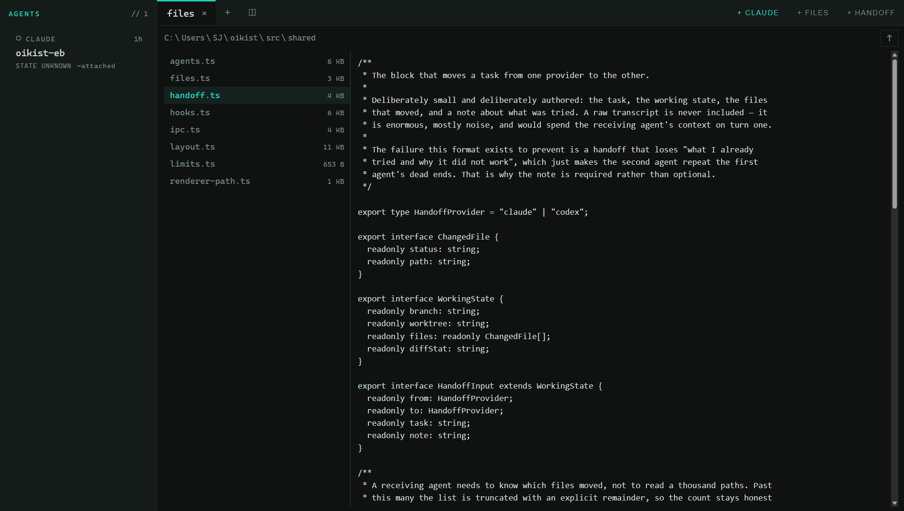

# oikist

**An agent-native development environment for Windows.** Coding agents are first-class
objects here — not processes that happen to live inside terminal panes.

*oikistēs* (οἰκιστής): the founder who leads settlers to new ground, and sets its
boundaries.



*Two agents, two levels of knowledge. The top row was launched by oikist, so it reports
`IDLE` through its own hooks. The one below was found already running — its identity is
real, but nothing has said what it is doing, so it says `STATE UNKNOWN` instead of
guessing.*

---

## The problem it exists for

On a normal working day here the split is roughly **75% agent panes, 15% human shell,
10% everything else**. At that ratio the agent is not a feature inside an IDE — it is
the primary object, and the terminal is one pane type among several.

Two problems fall out of that, and neither is solved well anywhere today:

**Attention.** With several agents running, knowing *which one is blocked on you* — and
getting to it — is the difference between parallel work and thrashing.

**Routing and handoff.** Providers hit rate limits at different times. Moving a task
between them means rebuilding context by hand, which is slow enough that you usually
just wait instead.

## What it does

### Agents are objects, and the app knows how much it knows

Every row states **how it is known**, because a status panel that presents a guess as a
fact stops being believed the first time it is wrong:

- **`launched`** — oikist started it, assigned its session id with `--session-id`, and
  installed hooks for it. Its state is *reported*, not inferred.
- **`~attached`** — found running via `claude agents --json`. Identity is real; nothing
  has said what it is doing, so the row says `STATE UNKNOWN`.

Agents oikist launches report `IDLE` / `WORKING` / `NEEDS PERMISSION` through their own
hooks, and name the subagents they spawn. Nothing is ever written to your global
`~/.claude/settings.json` — hooks go in a per-launch `--settings` file, so an agent you
start by hand behaves exactly as it did before oikist existed.

### A terminal that is actually a terminal



xterm with the WebGL renderer, `node-pty` over ConPTY. Output is coalesced into roughly
one frame before crossing the IPC boundary, which collapses ~425,000 pty reads into
~5,400 messages on a 30 MB stream. Tabs, an optional 2-up split, and a layout that comes
back after a restart.

### Moving a task between providers



Codex answers exactly how much is left — used percentages and reset times for both
windows, read from its app server. Claude publishes no usage command at all, so its row
says so rather than inventing a number.

The handoff block carries the task, the working state, the changed files, and an
**agent-authored note about what was already tried** — and never a transcript, which is
mostly noise and would spend the receiving agent's context on turn one. A missing note
blocks the copy, because a handoff without "what I tried and why it failed" just makes
the second agent repeat the first agent's dead ends.

### Restore never starts an agent



Opening the app must not spend quota, and an agent resuming work nobody is watching is
worse than one that waits. Every restored agent pane comes back **dormant** — the flag
is imposed by the parser, not read from the file, so no stored layout can cause a launch
on startup. It shows what it was and the session it can resume, and starts on a click.

### A read-only file viewer



Read-only by decision, not omission: there is no write, rename or delete channel behind
it to reach for. Bounded reads, binaries refused rather than rendered as garbage.

---

## What is interesting about how it was built

Every architectural decision is recorded with its reasoning in
[`docs/DECISIONS.md`](docs/DECISIONS.md), including the ones that were **reversed**.

**It started as a fork of Wave Terminal, and the fork was abandoned after measuring.**
The upstream is ~150k LOC, and the majority of its Go backend exists to solve remote
connections — which this project never uses. Its terminal is `@xterm/xterm`; its editor
is `monaco-editor`. Both are `npm install`. That left ~150k lines to inherit for nothing
the product actually needed. [The reasoning is written down](docs/DECISIONS.md#1-greenfield-not-a-fork-of-wave-terminal).

**The Electron-vs-Tauri question was settled by measurement, with the rule fixed in
advance.** It turned out neither host was the bottleneck: the same file streams at
**26.9 MB/s through a plain pipe and under 1 MB/s through a pty**, while Electron's IPC
bridge carries **299 MB/s**. ConPTY is the ceiling, and it sits upstream of both
candidates. [`docs/M0-SPIKE.md`](docs/M0-SPIKE.md).

**Findings that cost nothing but changed the design.** `claude doctor` prints its
complete hook-event list when it meets an unknown one, so the whole surface is
enumerable without spending a token. Claude 2.1.238 silently dropped `status` and
`waitingFor` from its live-session files, which killed the predecessor's entire
poll-based activity inference — a good argument for reading supported APIs instead of
scraping. [`docs/KNOWN-ISSUES.md`](docs/KNOWN-ISSUES.md).

**Mistakes are recorded, not tidied away.** A published claim that pty batching cost 45%
throughput was wrong — it compared two different harnesses rather than two consumers,
and batching is in fact *faster*. The wrong version and the reason it was wrong are both
kept in the spike record. A shutdown defect that took an afternoon turned out to be three
lines of my own code, after eight other suspects were ruled out; the postmortem is more
reusable than the fix.

## Architecture

```
main process                                    renderer
─────────────────────────────────────────       ──────────────────────
PtyManager        node-pty over ConPTY,          xterm + WebGL
                  8 ms output coalescing   ──►   tabs, 2-up split
AgentLauncher     --session-id, per-launch       agent rail
                  --settings hooks               read-only file viewer
AgentDiscovery    claude agents --json (5 s)     handoff composer
hook listener     127.0.0.1:0, per-run token
LayoutStore       plain JSON, atomic writes
```

The renderer is sandboxed with context isolation, served over a registered `app://`
scheme so a strict CSP actually applies, and reaches the OS only through explicitly
named IPC channels — there is no generic `invoke(channel)` escape hatch.

**Stack:** TypeScript · Electron · React 19 · `@xterm/xterm` + WebGL · `node-pty` ·
`electron-vite`. No database, one native dependency.

**Testing split, deliberate and written down:** the domain layer is TDD'd — 110 tests
covering pure reducers, untrusted-input parsers and the hook contract — while the UI is
verified by looking at it, through an in-app capture affordance rather than desktop
screenshots.

## Scope

**Windows only**, built for one machine. Not an apology and not temporary — most agent
tooling is mac-first, so this is a deliberate niche.

**Out of v1:** SSH/remote · multi-platform · Monaco *editing* · command palette · project
dashboards · local/NPU models · unsupervised agent-to-agent messaging · worktree
comparison · plugins · theming. That fence is load-bearing; the way a project like this
dies is building feature 12 of 40 and never switching to it.

## Status

All nine milestones are built and every feature above works. **It is not finished**, by
its own definition of done: all six switch-bar items have to work, *and* oikist has to
carry one full working day without falling back to the editor it replaces.

The second half has not happened yet, and it is the half that finds what the tests
cannot. Known issues are tracked in [`docs/KNOWN-ISSUES.md`](docs/KNOWN-ISSUES.md).

## Running it

```
npm install
npm run dev
```

Requires Node 24+, Windows 10/11, and Claude Code and/or Codex on `PATH` for the agent
features. `npm test` runs the suite; `npm run bench <fixture>` measures terminal
throughput.
